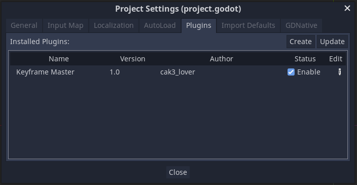

# Keyframe Master -v1.0

Tired of adding the same keyframes for multiple nodes? I got you covered!  
With this plugin you can automate the process so you can focus more on your animations!

(Testing on v.3.5.stable.mono.official)

 

## Setup
To get started, Paste the `Keyframe Master` folder inside the addons folder & check enabled ( [more on addons](https://youtu.be/Ca2FcVb2lBk?t=124) )

 

## How to use?

Let us take this setup as an example

 

## Adding Multiple Keyframes

I. Open the desired animation in the bottom panel (in this case 'New Anim') & set the timebar to the desired time (in this case 0.4)

II. Select the multiple nodes for which you'd like to add the keyframes (in this case 'Icon' & 'Icon2')

III. Click on `Keyframe Master` button & type in the property you would like to add (in this case 'position')

and press add or remove to insert/delete a column of keyframes into/from the animation

## Moving Multiple Keyframes

Similarly, you can also move keyframes to the desired time stamp (in this case 0.1)

after pressing `Move` you can see that the entire column has moved to the timestamp 0.1

If you press `Duplicate` instead then the keyframes would get duplicated at timestamp 0.1

I hope this helps & speeds up your workflow!

 

### Known Issues

<ul>
    <li>Undo-Redo not available</li>
    <li>Gives `Condition "key == -1" is true. Returned: false` Error upon moving</li>
</li>
